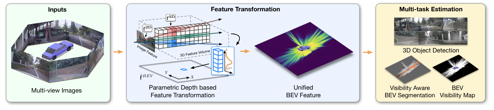

# [](https://github.com/NVlabs/ParametricBEV/blob/main/LICENSE)

## ParametricBEV: Parametric Depth Based Feature Representation Learning for Object Detection and Segmentation in Bird’s-Eye View

<div align="center">
  
</div>
<p align="center">
  Figure 1: Given multi-view images and camera parameters, our framework utilize parametric depth to transform image feature into BEV space for jointly estimating 3D object detection, BEV segmentation and a BEV visibility map.
</p>

Parametric Depth Based Feature Representation Learning for Object Detection and Segmentation in Bird’s-Eye View<br>
[Jiayu Yang](https://github.com/JiayuYANG), [Enze Xie](https://xieenze.github.io/), [Miaomiao Liu](http://users.cecs.anu.edu.au/~mliu/) and [Jose M. Alvarez](https://alvarezlopezjosem.github.io/).<br>
ICCV 2023

[ArXiv](https://arxiv.org/abs/2307.04106)

## Installation

Install dependencies following the [installation instructions](https://mmdetection3d.readthedocs.io/en/latest/get_started.html)

Install ParametricBEV by
```
git clone https://github.com/NVlabs/ParametricBEV.git
cd ParametricBEV
pip install -v -e .
```

Please see [here](https://mmdetection3d.readthedocs.io/en/latest/get_started.html) for full installation instructions and troubleshooting.

## Data preparation

Download the [NuScenes](https://www.nuscenes.org/nuscenes) dataset.

Extract and link it into ```data/nuscenes/```.

## Training and Inference
We follow the training and inference methods in [mmdetection3d](https://github.com/open-mmlab/mmdetection3d)

Training config is provided in ```configs/pdbev/joint/pdbev_joint_sup_r50_biased.py```

Modify the training parameters to suit your machine in ```configs/pdbev/joint/pdbev_joint_sup_r50_biased.py``` 

Start training by ```./tools/dist_train.sh ${CONFIG_FILE} ${GPU_NUM} [optional arguments]```

Start testing by ```python tools/test.py ${CONFIG_FILE} ${CKPT_FILE} [optional arguments] ```

Alternative training methods and arguments can be found in [Train&Test documentation](https://mmdetection3d.readthedocs.io/en/latest/user_guides/train_test.html).

## License
Please check the LICENSE file. ParametricBEV may be used non-commercially, meaning for research or 
evaluation purposes only. 

For business inquiries, please contact 
[researchinquiries@nvidia.com](mailto:researchinquiries@nvidia.com).

## Citation
```
@article{yang2023parametric,
  title={Parametric Depth Based Feature Representation Learning for Object Detection and Segmentation in Bird’s-Eye View},
  author={Yang, Jiayu and Xie, Enze and Liu, Miaomiao and Alvarez, Jose M},
  journal={ICCV},
  year={2023}
}
```